# Employee Leave Management System | Business Analyst Portfolio Project

## Project Overview

The Employee Leave Management System (ELMS) is an end-to-end Business Analyst portfolio project developed using Agile Scrum methodology. This project demonstrates the complete Business Analysis lifecycle, including requirement gathering, documentation, backlog management, sprint planning, user stories, wireframing, and project collaboration using Jira and Confluence.

---

# Business Problem

Many organizations still manage employee leave through emails and spreadsheets, resulting in:

- Delayed approvals
- Manual errors
- Poor leave tracking
- Lack of transparency
- Inefficient reporting

The proposed solution digitizes the complete leave management process for Employees, Managers, and HR.

---

# Project Objectives

- Automate employee leave requests
- Simplify manager approval workflow
- Track leave balances
- Improve HR efficiency
- Generate leave reports
- Enhance employee experience

---

# Stakeholders

- Employee
- Reporting Manager
- HR Department
- System Administrator

---

# Tools Used

- Jira
- Confluence
- Agile Scrum
- Business Requirement Document (BRD)
- Functional Requirement Document (FRD)
- User Stories
- Wireframing

---

# Project Deliverables

- Business Requirement Document (BRD)
- Functional Requirement Document (FRD)
- User Stories
- Acceptance Criteria
- Product Backlog
- Sprint Planning
- Epic
- Stories
- Subtasks
- Wireframes
- Jira–Confluence Integration

---

# Functional Modules

- Employee Login
- Employee Dashboard
- Apply Leave
- Manager Approval
- HR Dashboard
- Leave Reports

---

# Agile Workflow

Requirement Gathering → BRD → FRD → User Stories → Wireframes → Product Backlog → Sprint Planning → Development

---

# Project Documents

- 📄 [Business Requirement Document (BRD)](BRD.pdf)
- 📄 [Functional Requirement Document (FRD)](FRD.pdf)

---

# Jira Sprint Board

### Sprint Board - Part 1

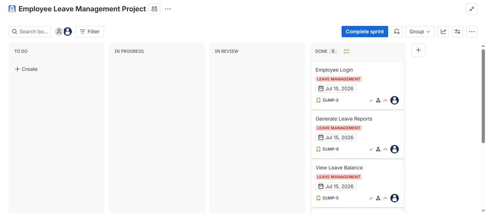

### Sprint Board - Part 2

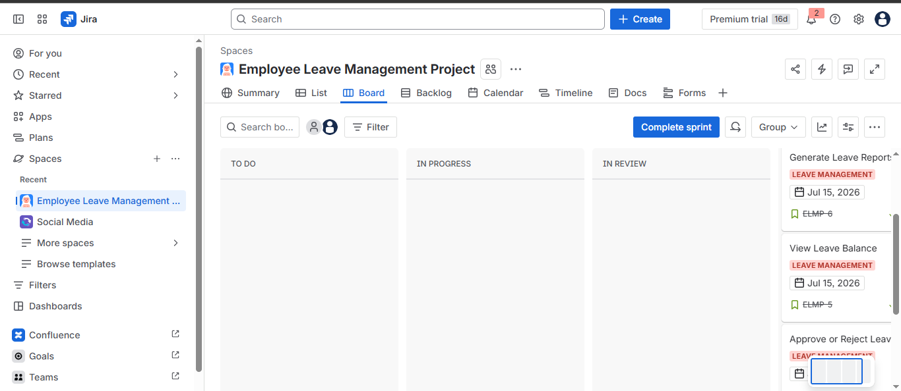

### Sprint Board - Part 3

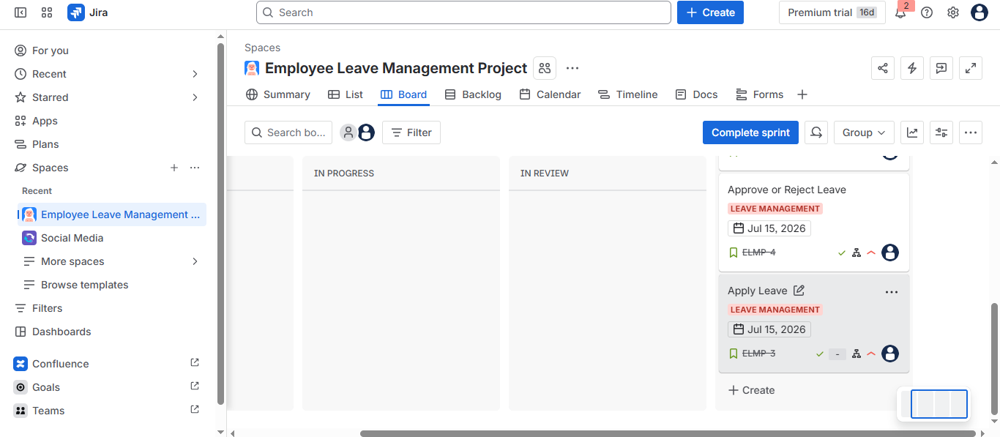

---

# User Story

### User Story - Page 1

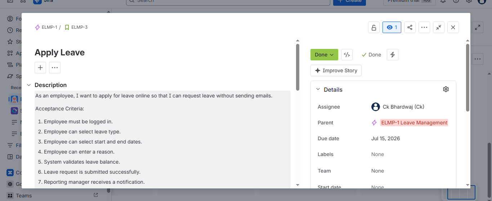

### User Story - Page 2

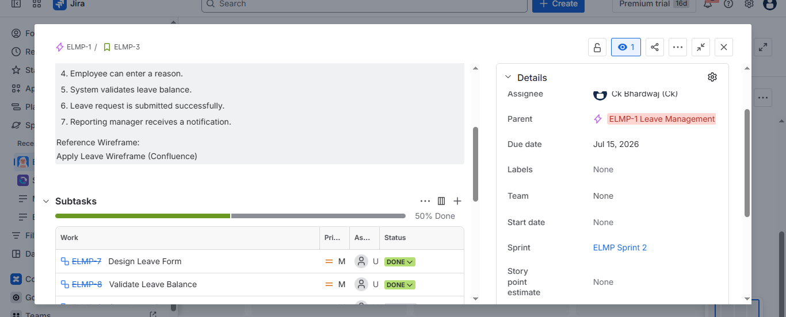

### User Story - Page 3

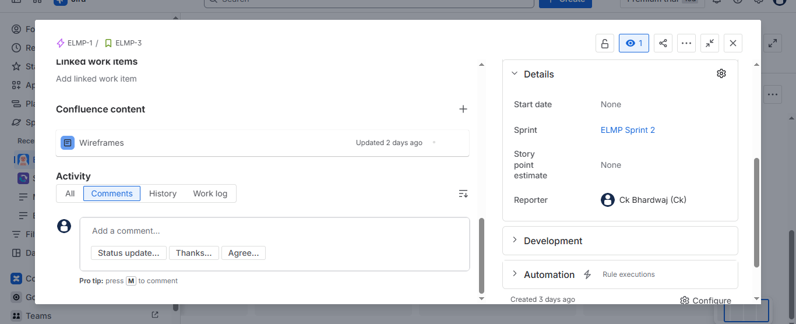

---

# Wireframes

## Login Screen

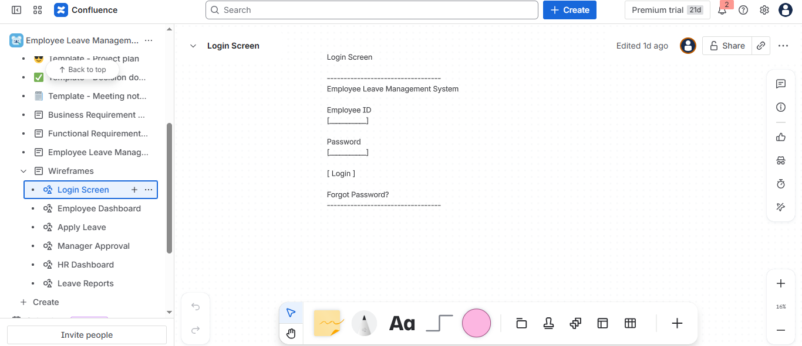

## Employee Dashboard

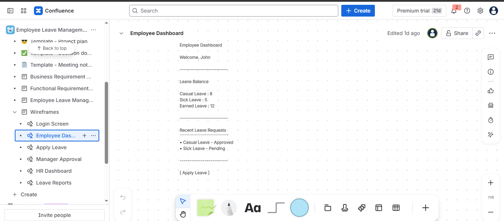

## Apply Leave

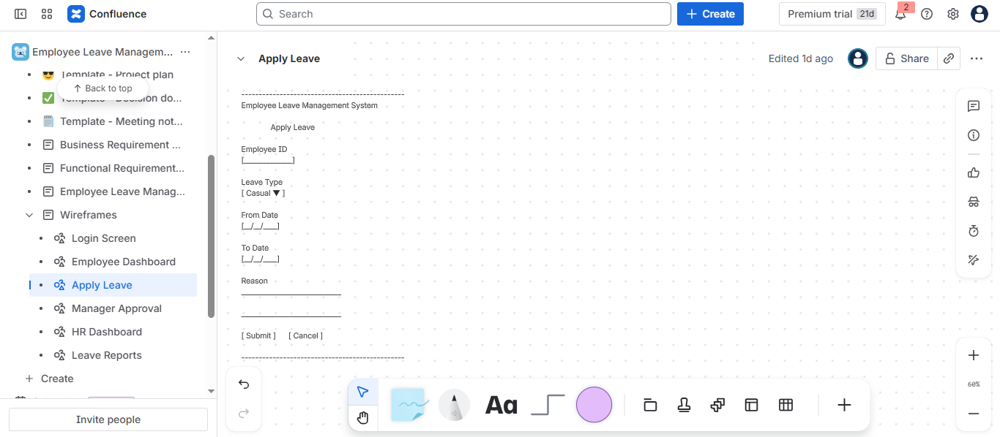

## Manager Approval

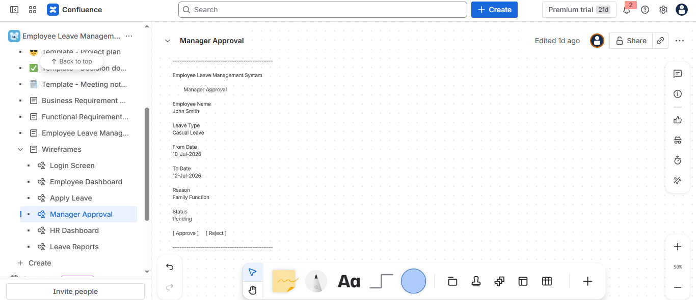

## HR Dashboard

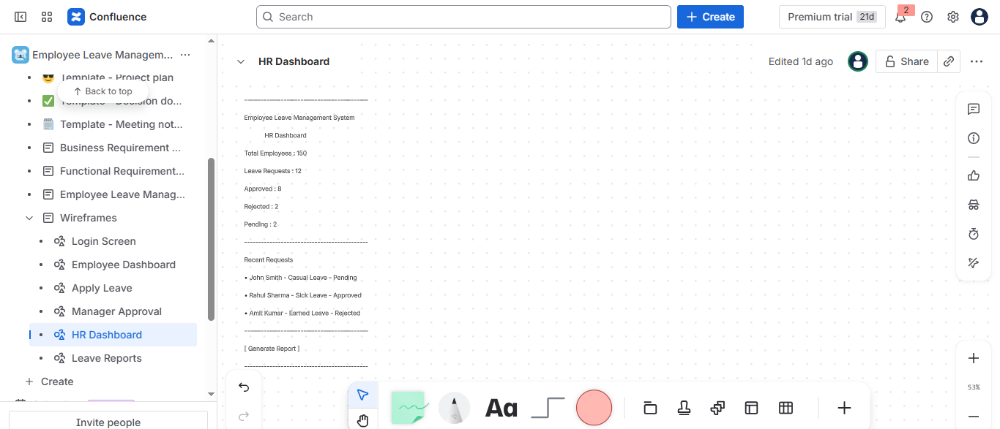

## Leave Reports

---

# Skills Demonstrated

- Business Analysis
- Requirement Gathering
- Business Requirement Documentation (BRD)
- Functional Requirement Documentation (FRD)
- User Story Writing
- Acceptance Criteria
- Agile Scrum
- Sprint Planning
- Product Backlog Management
- Jira
- Confluence
- Wireframing
- Stakeholder Communication

---

# Repository Contents

- BRD.pdf
- FRD.pdf
- Sprint Board Screenshots
- User Story Screenshots
- Login Screen Wireframe
- Employee Dashboard Wireframe
- Apply Leave Wireframe
- Manager Approval Wireframe
- HR Dashboard Wireframe
- Leave Reports Wireframe

---

# Author

**Chanderkant**

Business Analyst | MIS Executive

**Technical Skills:** SQL, PostgreSQL, Power BI, Excel, Python, Jira, Confluence
- Confluence
- Wireframing
